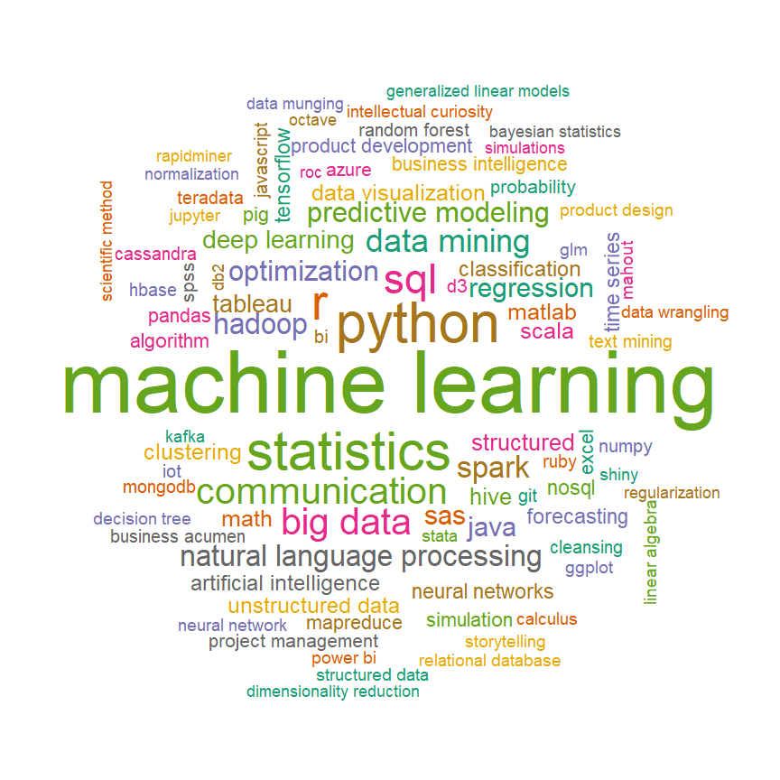
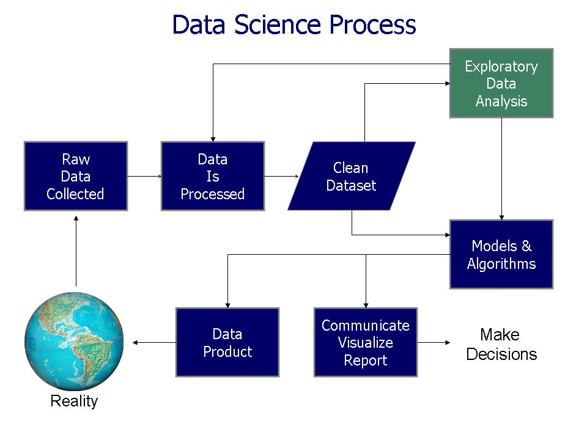
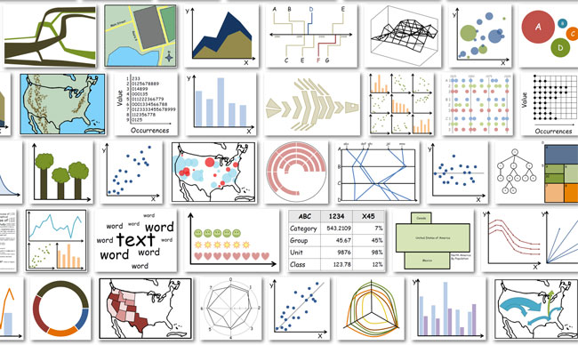
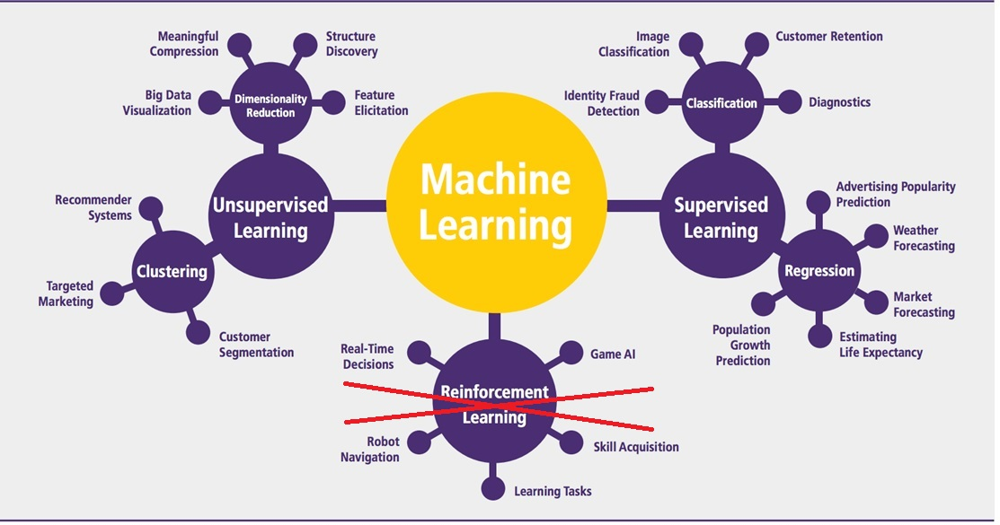
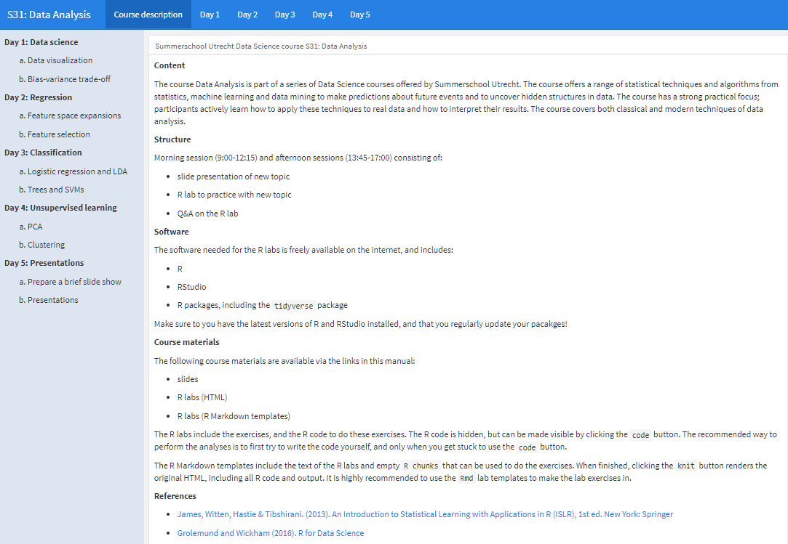
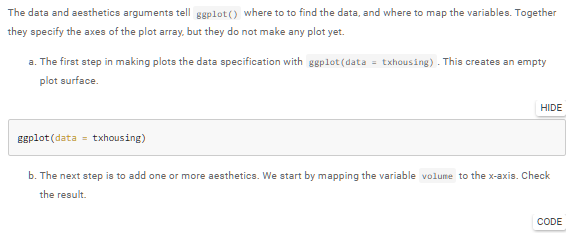
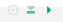
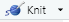
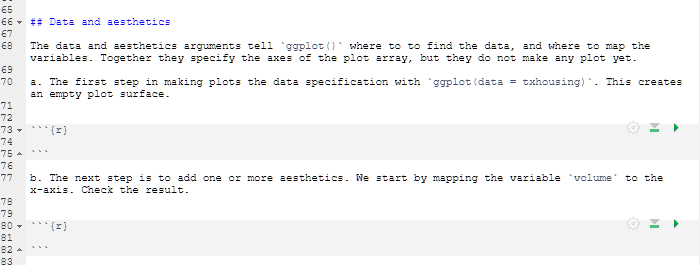

## Summerschool Data Science 


**Part of Data Science program**


- Statistical programming with R

- Multiple imputation in practice

- Introduction to text mining

- **Data analysis**

- Applied text mining


$~$ 

DAV course materials:

- links to slides, labs and literature in the course manual

## Data science word cloud

```{r echo=F, out.width="110%", out.width="80%"}

```

## Data science process

```{r echo=F, out.width="110%", out.width="80%"}

```

## Data visualizations

```{r echo=F, out.width="110%", out.width="80%"}

```


## Models & Algorithms

```{r echo=F, out.width="100%"}

```


## Manual




## Aims


**Data analysis**

1. Basics of data visualization with `ggplot2`

2. Overview of models/techniques for statistical learning

3. Basic understanding the underlying algorithms

4. Ability to apply data analysis techniques on data


$~$

Course is non-technical, emphasis on applications

## Structure of the course

**Day 1 to 4: Morning and afternoon sessions**

- introduction new topic (45 min.)

- R lab session (2 hr)

- Q\&A R lab (45 min.)

- lunch from 12:30 to 1:30 pm 

$~$

**Day 5: Presentations**

- Groups of 3-6 students  

- Prepare slides of a data analysis (morning)  

- Present results slideshow (afternoon)


## Code folding

- Labs are HTML files

- R code can be made visible by clicking the `CODE` button 

- try before peeking, and experiment with the code (try out other options)



## Rmd templates

- Open the template in RStudio

- write your code in the R chunks 

- test it by clicking the {width=30px} button

- renders HTML document by clicking {width=30px} button





