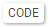

```{r include=FALSE}
knitr::opts_chunk$set(message=FALSE)
```

---

# Instructions

1. Save the file in one of your folders

2. Insert R code in the empty R chunks

3. Run the code by clicking the green right arrow at the topright of the chunk

    - if an assigment is made, the object appears in the Global Environment 
    
    - if output is requested, it appears within the Rmd file below the R chunk
    
    - if an error message appears, correct the code 
    
4. Knit the HTML document by clicking the `Knit` button.
    
    - make sure the code error free, otherwise the knitting will fail

---

# Overview


For this lab you need the R package `ggplot2`. Install the package if you haven't done that yet, and load it in workspace with the function `library()`. The aim of this lab is to get acquainted with building plots layer-by-layer with the `ggplot()` function, and with the basic geometries for displaying numeric and categorical variables.

For help on the `ggplot2` functions, check the [Data Visualization Cheat Sheet](https://github.com/rstudio/cheatsheets/raw/master/data-visualization-2.1.pdf)


```{r}

```

Make the exercises in the R Markdown template `1A-Lab-Template.Rmd`. You'll find instructions on how to work with R Markdown documents in the template.

The code fo the exercises can be made visible by clicking the , but first try to find the solution yourself. 

---

# Building plots 

In this lab we use the data set `txhousing` (run `?txhousing` at the prompt to see its help page).


## Data and aesthetics 

The data and aesthetics arguments tell `ggplot()` where to to find the data, and where to map the variables. Together they specify the axes of the plot array, but they do not make any plot yet. 

a. The first step in making plots the data specification with `ggplot(data = txhousing)`. This creates an empty plot surface. 


```{r}

```

b. The next step is to add one or more aesthetics. We start by mapping the variable `volume` to the x-axis. Check the result.


```{r}

```

c. Next, we add anther aesthetic by mapping the variable `sales` to the y-axis. Again check the result.

```{r}

```


---

## Geoms

The geoms determine how the data are represented in the plot. There are many different geoms, including those for displaying histograms, lines, points, densities, bars, boxplots, etc.

a. The previous plot includes the numeric variables `volume`  and `housing`, and the common way to represent two numeric variables is a scatter plot. Find the appropriate geom to display a scatter plot of `volume` and `housing`. (`ggplot`  generates a warning about missing values. You can prevent this by using `na.omit(txhousing)` as data specification.)

```{r}

```


b. Add a (non-linear) regression line to the previous plot that describes the relationship between `volume` and `sales`.

```{r}

```

c. The data are collected over the period 2000-2015. Use a 3rd aesthetic `color` to color the points in the scatter plot by year. 

```{r}

```


## Scales, facets, themes

The scale on which the axis are represent can be changed by adding a `scale`  layer to the plot. For example, `scale_y_sqrt()` transforms the y-axis to the square root of the original values, and `scale_y_log10()` takes the logarithm of the original values. Thes kind of transformations can be useful to reduce heteroscedasticity (non-constant variance around the regression line).  

a. Display the previous plot choosing the transformation that does the best job in reducing heteroscedasticity. 

```{r}

```

Facets are multiples of the plot, split up by the levels of categorical variable.  

b. Remove the variable `year` from the aesthetics,  and use the `facet_wrap()` or `facet_grid()` function to make multiples by `year`.

```{r}

```

Themes are uses to change the look of the plot. 

c. Check the theme options in the cheat sheet, and choose a theme of your liking to display the previous plot.

```{r}

```

# Other geoms

In the previous exercise we used geoms for two numeric variables to display a scatter plot with a regression line. We will now briefly explore some geoms for categorical variables, and for combinations of numeric and categorical variables.

a. Display a histogram of the variable `sales`, with the x-axis dsiplayed on a logarithmic scale.

```{r}

```

b. Add the aesthetic `fill = factor(month)` to the plot

```{r}

```

c. The previous plot is a bit crowded with colors. A better option is to produce separate  histograms for each month. Disply this plot.

```{r}

```

d. Change the geom of the previous plot so that densities instead of histograms are displayed.

```{r}

```

d. Display the same graph as in exercise b, but with a geom that creates boxplots for each month (specify `month` as `factor`).  

```{r}

```

---


END OF LAB.


