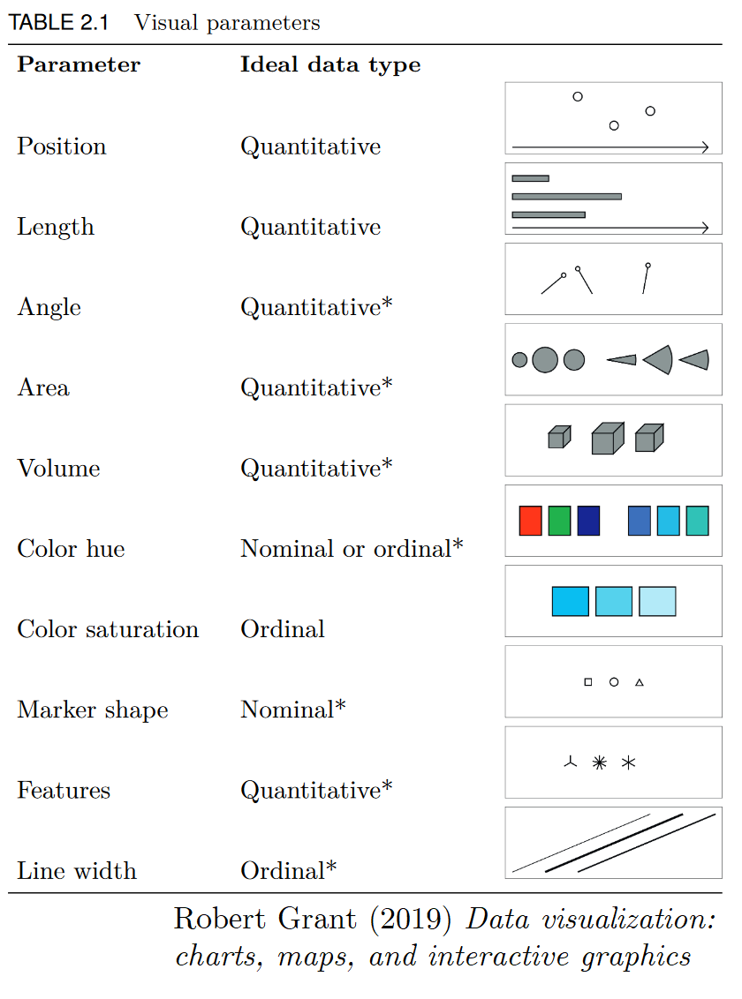

 

```{r include=F, message=F}
library(tidyverse)
library(gridExtra)
library(cowplot)
```


## Program


## Content

**Data visualization**


1. Exploratory data analysis

2. Tufte's Principles of Graphical Excellence

3. Grammar of Graphics

4. Some examples

5. Lab preview

## What's data visualization?

Communication of data by encoding it as visual objects, i.e.

- dots, lines, bars, etc.


$~$

to make data more accessible, understandable and usable.

## Integral part of data science process

```{r echo=F, out.width="100%"}
knitr::include_graphics("pics/datascience.png")
```


## Exploratory data analysis

Visualize variation and covariation in your data

- discover unexpected patterns in your data

- detect outliers and other anomalies

- understand your data

$~$

Get new ideas about your data!

## Early example

\footnotesize 

The 1854 Soho cholera outbreak was not due to 'miasma' (John Snow)

```{r echo=F, fig.align="center"}
knitr::include_graphics("pics/JohnSnow.jpg")
```

# Tufte's Principles of Graphical Excellence

## Guidelines for representing visual information 

"Graphical excellence is that which gives to the viewer the greatest number of ideas in the shortest time with the least ink in the smallest space." **Edward R. Tufte, The Visual Display of Quantitative Information**

$~$

- Proportionality principle

- Maximize data-to-ink ratio

- Omit chart junk


## Proportionality principle

\footnotesize

Proportion of ink should be directly proportional to the **numerical quantities** represented. 

```{r echo=F, out.width="100%", fig.align = 'center'}

```

## Maximize data-to-ink ratio

Try using color and text separately

```{r echo=F, out.width="90%", fig.align = 'center', fig.cap="Figures from darkhorseanalytics.com"}

```


## Omit chart junk


```{r echo=F, out.width="100%", fig.align = 'center'}
knitr::include_graphics("pics/junk-diamonds.jpg")
```


## Tufte in practice

```{r echo=F, out.width="60%", fig.align = 'center'}

```

# Additional Advice

## Avoid pie charts at all costs

Pie charts are the worst charts.

1. It is hard to compare angular differences within a chart

2. Comparing multiple charts is very hard

3. Matching labels is confusing

4. Orientation of slices affects perception

5. Coloring of slices affect perception


```{r echo=F, out.height="45%", fig.align = 'center'}

```

*"The only thing worse than a pie chart is several of them."*

## Replace pie charts with (stacked) bar charts

```{r echo=F, out.height="90%", fig.align = 'center'}

```

## Better to avoid box/dynamite plots

Box plots (and dynamite plots) are very prevalent, though they miss a lot of valuable information/differences.

```{r echo=F, out.height="50%", fig.align = 'center'}

```

You may use violin/pirate plots (`yarrr::pirateplot()`), jitterred scatter plots (`geom_jitter()`), or raincloud plots (`raincloudplots`) instead.
See [this tutorial](https://www.cedricscherer.com/2021/06/06/visualizing-distributions-with-raincloud-plots-with-ggplot2/).


## Avoid adding more dimensions

If you are plotting a one-dimensional variable, only represent it with one dimension (cf. proportionality)

```{r echo=F, out.width="70%", fig.align = 'center'}

```

## Avoid 3D in general

Reading a plot should not require spatial reasoning.

```{r echo=F, out.width="100%", fig.align = 'center'}
knitr::include_graphics("pics/no-3d.png")
```

## Consider (not) including zero in the y-axis

**Oftentimes** truncating the y-axis is misleading (cf. [this blog post](https://digitalblog.ons.gov.uk/2016/06/27/does-the-axis-have-to-start-at-zero-part-1-line-charts/)).

```{r echo=F, out.width="100%", fig.align = 'center'}

```

## Rethink before plotting data on maps

Coloring regions on maps are often misleading.

```{r echo=F, out.width="100%", fig.align = 'center'}

```

## Consider (colorblind-friendly) colors

Up to [10% of adults](https://www.colour-blindness.com/general/prevalence/) live with some degree of color vision deficiency (CVD), and the red-green colorblindness is most prevalent (8%).

Moreover, your plots will most-likely be printed in black and white.

```{r echo=F, out.height="40%", fig.align = 'center'}
knitr::include_graphics("pics/cvd-test.jpg")
```

- Use "safe" colorsets, e.g.,
`munsell`,
`viridis`,
`RColorBrewer`,
`dichromat`,
`colorblindr`,
`shades`,
`ggsci`.

- Simulate colorblindness on your plots using `colorblindr` package. Try it online: http://hclwizard.org:3000/cvdemulator


# Grammar of Graphics

## R data science packages

The `tidyverse` package 

```{r echo=F, out.width="90%"}
knitr::include_graphics("pics/tidyverse.png")
```


## The `ggplot2` package

Grammar of Graphics

- Build plots layer-by-layer

```{r echo=F, out.width="100%"}
knitr::include_graphics("pics/grammargraphics.png")
```

## Content of building blocks

```{r echo=F, out.width="100%"}
knitr::include_graphics("pics/grammar.png")
```


## How to choose a chart?

Check *from Data to Viz* ([data-to-viz.com](https://www.data-to-viz.com/)) to find an appropriate plot:

```{r echo=F, out.height="60%", fig.align = 'center'}

```

Browse plots with example codes in R Graph Gallery ([r-graph-gallery.com](http://www.r-graph-gallery.com/)).


## Translation to aesthetics, geoms, etc.


```{r echo=F, out.height="90%", fig.align = 'center'}

```

# Using `ggplot()` 

## Data and aesthetics

The function `ggplot()` has two main arguments:

```{r eval=F}
ggplot(data = <data>, mapping = aes(x = <var>, y = <var>, ...))
```

- `<data>` name of the data set 

- `mapping` maps variables to `aes`thetics (axis, color, group, etc.) 

## Example

- `ggplot(mpg)` creates an empty plot array for data set `mpg`

- `aes(x = cty, y = displ)` maps variable values to axes

\scriptsize
```{r fig.asp = .4, message=F}
grid.arrange(
  ggplot(mpg),                                           
  ggplot(mpg, aes(x = cty, y = displ)),                           
nrow = 1)
```

## Geometrics

Geoms define shapes for representation (lines, points, bars, etc.)

- geoms are added with `+` sign

- multiple geoms can be added to same plot (e.g points and  lines)


```{r eval=F}
ggplot(data = <data>, mapping = aes(x = <var>, y = <var>)) +
  geom_point() +
  geom_line()
```

## Example

Scatter plot plus regression line

\scriptsize
```{r message=F, fig.asp=.45}
ggplot(mpg, aes(x = cty, y = displ)) +
  geom_point() +
  geom_smooth()
```

## Another example

\scriptsize
```{r fig.asp = .4, message=F}
grid.arrange(
  
  ggplot(mpg) + 
    geom_bar(aes(class)),
  
  ggplot(mpg) + 
    geom_count(aes(class, drv)),

  nrow = 1)
```


## Coordinates and scales 

Flip the axis or transform the scales of the axes

\footnotesize
```{r fig.asp = .4, message=F}
grid.arrange(
  ggplot(mpg) + geom_boxplot(aes(manufacturer, hwy)) + coord_flip(),
  ggplot(mpg) + geom_boxplot(aes(manufacturer, hwy)) + coord_flip() + 
    scale_y_log10(),
nrow = 1)
```

## Facets

Make separate plots for the levels of a categorical variable (`factor`)

\footnotesize
```{r fig.height= 4}
ggplot(mpg, aes(x = cty, y = hwy)) +
  geom_point() +
  facet_wrap(vars(class)) 
```

## Themes

\scriptsize
```{r fig.asp = .5, message=F}
grid.arrange(
  ggplot(mpg) + geom_point(aes(displ, hwy)) + theme_light(),
  ggplot(mpg) + geom_point(aes(displ, hwy)) + theme_classic(),
  ggplot(mpg) + geom_point(aes(displ, hwy)) + theme_minimal(),
  ggplot(mpg) + geom_point(aes(displ, hwy)) + theme_void(),
  nrow = 2)
```


## Preview lab 1A

1. Make plots with `ggplot2`

2. Combine aesthetics, geoms, facets, themes


$~$

Make the exercises in the R Markdown template 

- Open template in RStudio and read the instructions

- Save the file in an appropriate folder

- Insert R code in the R chunks

- Run the chunks to test for errors 

- Knit the HTML file when the code is error free
