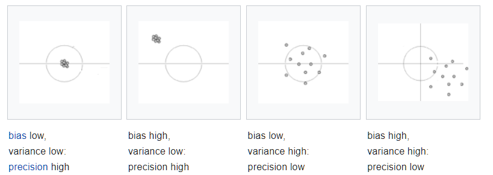

 
## Program


## The trade-off


## Content

1. Supervised learning

2. Statistical models

3. Bias-variance trade-off

4. Train/dev/test paradigm 

5. The `caret` package


# Supervised learning

## Statistics vs supervised learning

Traditional statistics:

- hypothesis testing

- confirmation of theory

    - intervention X has significant effect on outcome Y
    
$~$

Data science:

- train a model on existing data

- to make predictions on new data

    - medical diagnosis
    
    - chess or backgammon program
    
    - face recognition


## Prediction of an outcome 

- outcome variable (supervisor)

- train the model using some algorithm to predict the outcome

```{r echo=F,  out.width="100%", fig.align = 'center'}

```

## Algorithm

A set of instructions to solve a problem 

```{r echo=F,  out.width="70%", fig.align = 'center'}
knitr::include_graphics("pics/algorithm.jpg")
```

## Model training

- distinction between training data and new data

- aim is to predict outcome in new data set

```{r echo=F,  out.width="100%", fig.align = 'center'}
knitr::include_graphics("pics/prediction.png")
```

## Learning by training?

```{r echo=F, out.width="40%", fig.align="center"}
knitr::include_graphics("pics/machine_learning.png")
```


Not really, there is a systematic approach!


# Statistical models


## Notation

**Mathematical representation of a theory** 

$$y=f(x)+\epsilon$$

- $y$ outcome/output/response/dependent variable 

- $x$ input/predictors/features

- $f(x)$ prediction function 

- $\epsilon$ (irreducible) prediction error 


## Competing $f(x)$

Many competing models

- linear regression

- nonlinear regression

- tree-based methods

- support vector machines

- neural networks

- etc.

$~$

Models differ in complexity and interpretability

## Model complexity and interpretability


## Model choice


"All models are wrong, but some are useful" (George Box)

$~$

What is the best model choice?

- no a priori best model

- depends on the data

- try out alternatives, and select the best performing


$~$

But how to determine which one perfoms best???

# Bias-variance trade-off

## Mean Squared Error 

Measurement of model performance:

- sum of squared differences between observations and predictions

$$MSE =\frac{1}{n}\sum(y-f(x))^2= \frac{1}{n}\sum\varepsilon^2$$
$~$

{width=150px}

## Bias vs variance


The expected MSE is composed of bias, variance and irreducible error

$$E(MSE) = bias^2 + variance + \sigma^2$$

$~$




## MSE vs model complexity


# Example

## Polynomial regression models

Increasing model complexity with polynomials

- Linear model with intercept and slope

$$f(x)=\beta_0+\beta{x}, \ \ \ \ \epsilon\sim{N}(0,\sigma^2_\epsilon)$$
- Quadratic model with intercept and  2 slopes

$$f(x)=\beta_0+\beta_1{x}+\beta_2x^2$$

- Cubic model with intercept and 3 slopes)

$$f(x)=\beta_0+\beta_1{x}+\beta_2x^2+\beta_3x^3$$

etc.

## Data points generated from $f(x)$

What is $f(x)$? And if polynomial, is it . . .

- linear, quadratic, cubic, etc.?

```{r echo=F}
set.seed(1)

x  <- runif(5, 1, 4)
xs <- seq(1, 5, length.out = 100)
y  <- 2 + x + .1*x^2 + rnorm(5)
plot(x, y, xlim=c(1, 5), ylim=c(2, 7), pch=19)
```


## Strategy for finding $f(x)$

Fit all polynomial models to the data

- compute the MSE for each model

- select the model with the smallest MSE

$~$

The model with the smallest MSE most resembles the true $f(x)$?


$~$

\centering{\textbf{TRUE?}}


## Predicted values for $y$

Regression lines linear, quadratic, cubic and quartic models

- quartic model fits data perfectly

```{r echo=F, message=F}
library(splines)
options(warn=-1)

d <-  data.frame(x, y)

bs1 <- lm(y ~ x, data = d)
bs2 <- lm(y ~ bs(x, degree=2), data = d)
bs3 <- lm(y ~ bs(x), data = d)
bs4 <- lm(y ~ bs(x, degree=4), data = d)


pred.bs1 <- predict(bs1, data.frame(x=xs))
pred.bs2 <- predict(bs2, data.frame(x=xs))
pred.bs3 <- predict(bs3, data.frame(x=xs))
pred.bs4 <- predict(bs4, data.frame(x=xs))

plot(x, y, xlim=c(1, 5), ylim=c(1, 10), pch=19)
lines(xs, pred.bs1, type="l", col=5)
lines(xs, pred.bs2, type="l", col=2)
lines(xs, pred.bs3, type="l", col=3)
lines(xs, pred.bs4, type="l", col=4)
```

## MSE

Comparison of the MSE of the fitted models

Fitted models | MSE 
-- | -- | --
linear    | `r round(mean((y-predict(bs1))^2), 4)` 
quadratic | `r round(mean((y-predict(bs2))^2), 4)` 
cubic     | `r round(mean((y-predict(bs3))^2), 4)` 
quartic   | `r round(mean((y-predict(bs4))^2), 4)` 

$~$ 

**So the quartic model is the best????**


## Five new data points from $f(x)$

Regression lines for original five data points

- How well do the models fit to these new five data points?

```{r echo=F}
set.seed(10)

x2  <- runif(5, 1, 5)
y2  <- 2 + x2 + rnorm(5)
plot(x2, y2, xlim=c(1, 5), ylim=c(1, 10), xlab="x", ylab= "y", pch=19)
lines(xs, pred.bs1, type="l", col=5)
lines(xs, pred.bs2, type="l", col=2)
lines(xs, pred.bs3, type="l", col=3)
lines(xs, pred.bs4, type="l", col=4)
```

## MSE for new data points


MSE of the new data points show different picture!

$~$

Fitted models | MSE 
---|--- | ---
linear    | `r round(mean((y2-predict(bs1, data.frame(x=x2)))^2), 3)` 
quadratic | `r round(mean((y2-predict(bs2, data.frame(x=x2)))^2), 3)` 
cubic     | `r round(mean((y2-predict(bs3, data.frame(x=x2)))^2), 3)` 
quartic   | `r round(mean((y2-predict(bs4, data.frame(x=x2)))^2), 3)` 

$~$ 

- quadratic models performs best

- quartic model performs extremely poor


## True $f(x)$

Data generated from from quadratic model:

$$f(x)=2+x + 0.1x^2+\epsilon, \ \ \ \ \ \epsilon\sim N(0,5)$$


$~$

**How to find the true quadratic model when only the original sample is available?**


# Train/dev/test paradigm


## Data partitioning

Split the sample in a training and test:

$~$

**Training set**: 

- to estimate the model parameters (train the model) 

- if  model includes hyperparameter(s), further split in training and validation sets   

    - training and validation of hyperparameterswith cross-validation


**Test set**: 

- to evaluate model performance 

- test set not involved in parameter estimation

- so if model has high variance, it will perform poorly on test set

- punishes overly complex models and thus avoids overfitting of the data 

## Train/test paradigm

Models without hyperparameters

1. Train the model on the traing set

2. Evaluate the model on the test set

```{r echo=F,  fig.align='center', out.width="60%"}

```


## Train/dev/test paradigm

Model with hyperparameters (parameter to control learning process)

1. Select hyperparameter with smallest cross-validation error

2. Train the model on the training set 

3. Evaluate the model on the test set

```{r echo=F,  fig.align='center', out.width="60%"}

```


## Train vs test MSE

Select the model with the lowest prediction error (MSE) on the test set

```{r echo=F,  fig.align='center', out.width="80%"}

```


# The `caret` package

## R package for training models


Short for **C**lassification **A**nd **RE**gression **T**raining

$~$

\url{https://cran.r-project.org/web/packages/caret/vignettes/caret.html}

$~$


Model training for over 40 different models 

\url{http://topepo.github.io/caret/available-models.html}

- data splitting

- pre-processing
    
- feature selection
    
- model tuning using resampling

- variable importance estimation


## Example $K$-nearest neighbors (KNN)

Flexible nonparametric model with hyperparameter $K$


$$f(x)=\frac{1}{K}\sum_{i=1}^K(y|x_i\in\text{neighborhood of } 4)$$


```{r echo=F, out.width="90%"}

```

Prediction for $x=4$ is average of the $K$ nearest data points  


## 


## Cross-validation procedure

Example for K-Nearest Neighbors (K is hyperparameter)

\footnotesize

```{r, echo=T, eval=F}
# inTrain contains the rownumbers for the training set
inTrain <- createDataPartition(y    = data$y,   # y is outcome
                               p    = .8,       # 80% training cases
                               list = FALSE)
Train   <- data[ inTrain, ]                     # training set
Test    <- data[-inTrain, ]                     # test set

# train KNN model on training set using 5-fold cross-validation
knn_train <- train(formula,
                   data      = Train, 
                   method    = "knn"
                   tuneGrid  = expand.grid(<range tuning parameters>),
                   trControl = trainControl(method = "cv", 
                                            number = 5)
                   )

# get predictions for test set
knn_test <- predict(knn_train, newdata = Test)
```


## Recap

Bias-variance trade-off:

- simple models may inderfit (bias), complex models may overfit (variance)

- train/test or train/dev/test procedure finds optimal bias-variance trade-off

    - cross-validation to find optimal hyperparameter values  (if present)
    
    - cross-validation sometimes used instead of train/test


$~$

The `caret` package

- splits the data in train and test 

- performs train/dev/test operation (including cross-validation)

- wide variety of models


## Lab 1B

1. Fit linear, quadratic and KNN model

2. Compare test MSE to select the best model 

3. Use `caret` data partition and cross-validation


