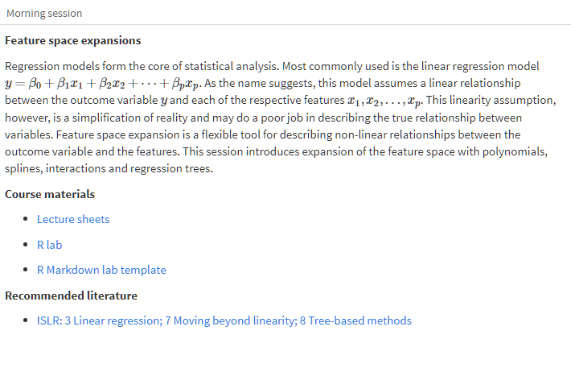
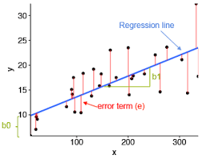
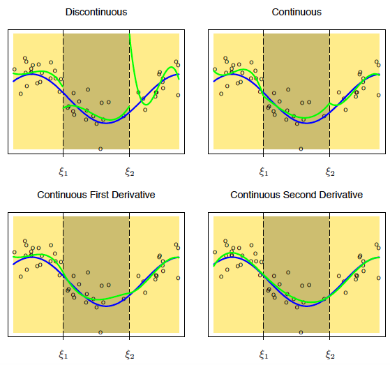
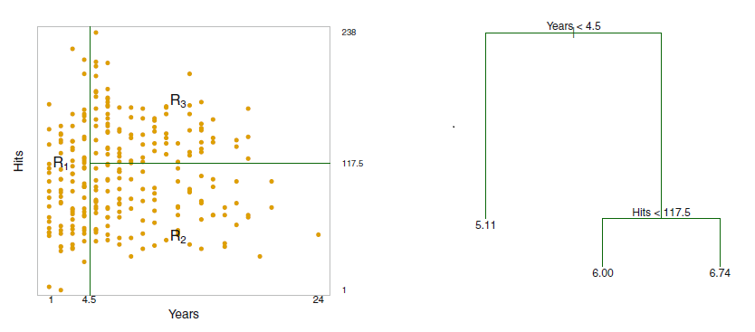

 

```{r include=F, message=F}
library(tidyverse)
library(gamlss)
library(splines)
library(rpart)
library(gridExtra)

knitr::opts_chunk$set(comment="",
                      echo=F,
                      warning = FALSE,
                      out.width = "\\linewidth")
```

## Program




## BMI Dutch boys

How to predict Body Mass Index from age? 

```{r}
ggplot(dbbmi, aes(x = age, y = bmi)) +
  geom_point(alpha = 0.2) + 
  theme_minimal()
```


## Content

1. Linearity

2. Polynomials

3. Splines

4. Regression trees


# Linearity

## Linearity assumption

Assumption of the linear regression model 

$$y=\beta_0+\beta{x}+\varepsilon,  \ \ \ \ \ \varepsilon\sim{N}(0, \sigma^2)$$

- predictions on straight regression line

- residuals normally distributed and homoscedastic

```{r echo=F, out.width="40%", fig.align="center"}

```

## Non-linearity

Different shapes and forms

- model choice depends on shape and form


```{r fig.asp=.3}
set.seed(1)
x <- runif(100, 0, 5)
quad1 <-  (exp(x/2 + rnorm(100, sd=.2)))/100
quad2 <- scale(x)^2 + rnorm(100, sd=.3)
cub1  <-  6*(scale(x))^2 - 2*(scale(x))^4 + rnorm(100, 4, 1)
tree  <- c(runif(33, 0, 1), runif(33, 2, 3), runif(34, 1, 2))

par(mfrow=c(1, 4))
plot(x, quad1, ylab="y")
plot(x, quad2, ylab="y")
plot(x, cub1, ylab="y")
x <- sort(seq(0, 5, length.out=100))
plot(x, tree, xlab = "x", ylab = "y")
```


## Accommodating non-linearity

Different models:

- polynomials 

$$y=\beta_0x^0+\beta_1x^1+\beta_2x^2+\beta_3x^3+\dots$$

- splines

     - fit polynomials to non-overlapping regions of $X$

$~$

- tree-based models

     - compute the mean in non-overlapping regions of $X$


# Polynomials

## Basis expansion


Expand the feature space with polynomials of $X$, e.g.

- the cubic polynomial

$$\hat{y}=\beta_0+\beta_1x+\beta_2x^2+\beta_3x^3$$


```{r fig.width=3, fig.height = 2, fig.align='center'}
d <- data.frame(x = seq(-4, 4, length.out = 100))
d %>% mutate(y1 = -2*x + 4*x^2 + 5*x^3,
             y2 = -3*x + 1.5*x^2 - x^3,
             y3 = -18*x -3*x^2 - 2*x^3) %>% 
  ggplot() +
  geom_line(aes(x, y1), col = "blue") +
  geom_line(aes(x, y3), col = "green") +
  geom_line(aes(x, y2), col="red") +
  theme_minimal()
```

## Making polynomials in R

The straightforward way

- use the function `I()` in the model formula

- `model.matrix()` creates the basis expansion

$~$

\footnotesize
```{r echo=T}
(M <- model.matrix(~ I(x^1) + I(x^2) + I(x^3), data.frame(x = 1:4)))
```


## Multicollinearity

Potential problem with `I()`

- multicollinearity, i.e. high correlation between $x,x^2,x^3$, etc.

$~$

Correlations between polynomials:

```{r echo=T}
round(cor(M[, -1]), 3)
```


## Orthogonal expansion


The function `poly(x, degree = 3)` creates on orthogonal basis

$~$

\footnotesize
```{r echo =T}
(P <- model.matrix( ~ poly(x, 3), data = data.frame(x = 1:4)))
```

Correlations

```{r echo=T}
round(cor(P[, -1]), 3)
```


# Splines


## B-splines 

- Place a number of knots $\xi$ that divide $X$ in non-overlapping regions

- fit cubic polynomial to each region 

- connect lines by equating 1st and 2nd derivative

```{r out.width="60%", fig.align="center"}

```

## Fitting cubic  splines in R 

Formula for generating B-spline basis matrix in R (package `splines`)

\footnotesize
```{r eval=F, echo=T}
bs(x, df = NULL, knots = NULL, degree = 3) # cubic spline

ns(x, df = NULL, knots = NULL, degree = 3) # natural cubic spline
```
\normalsize

- `degree = 3` for cubic polynomial (default)

- `df` number of knots (`df = degree + number of knots`)

- `knots` position of knots in percentiles

- natural cubic spline is linear beyond the boundary knots


## Basis matrix cubic spline with `df = 4`

\footnotesize
```{r echo=T}
bs(1:4, df = 4)
```


## Smoothing splines

Highly flexible spline

1. A _knot_ $\xi_i$ for each unique value $x_i$

2. `df` controls wiggliness (value between 1 and # $x_i$)


$~$

Fitting smooth splines in R

```{r echo=T, eval = F} 
smooth.spline(y ~ x, df = <nr>)  
smooth.spline(y ~ x)
```

- 1st: user-specified `df`

- 2nd: optimal `df` determined with cross-validation


# Regression trees


## Binary recursive partioning algorithm


1. Partition the feature space in distinct, non-overlapping regions 

2. Compute the mean of all observations within a region 

3. Select the partition that minimizes the MSE  

4. Continue partitioning until a stopping criterion is reached 

$~$

Tree function `rpart()` from package `rpart`

\footnotesize

```{r eval = F, echo=T}
reg_tree <- rpart(y ~ x, method = "anova")
plot(reg_tree)
text(reg_tree)
```

$~$

Warning: trees tend to overfit, more on this in classification 

## Example with one feature


```{r echo=F, fig.asp = 0.6, fig.cap = "Tree representation (left) and its predictions (right)"}
mtree <- rpart(tree ~ x, method = "anova")
par(mfrow = c(1, 2))
plot(mtree)
text(mtree)
plot(x, tree)
abline(v = 1.641)
abline(v = 3.308)
segments(0, .54, 1.64, 0.54, col = "red")
segments(1.64, 2.42, 3.31, 2.42, col = "red")
segments(3.31, 1.53, 5, 1.53, col = "red")
```


## Example with two features


Different way of looking at interactions


{width=400px}

## Preview Lab 2A

Topics

- polynomials

- splines

- trees


$~$

Next lab (Feature selection) features interactions
