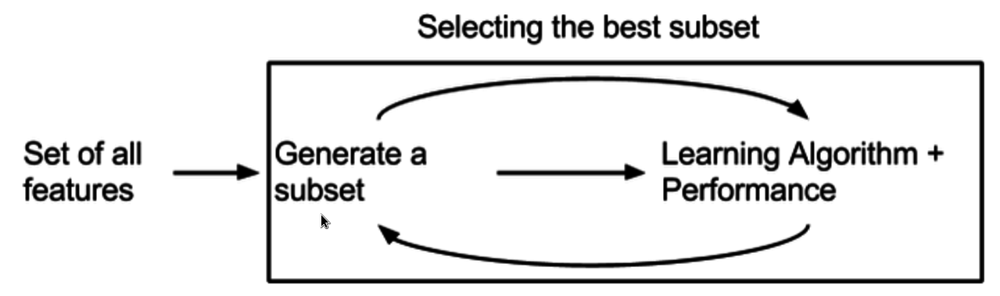

 

```{r include=F, message=F}
library(tidyverse)
knitr::opts_chunk$set(message=F)
```

## Program


## Prediction IMDb movie ratings

How to control variance with the following predictors:

\scriptsize

- title
- IMDb rating
- the number of IMDb raters
- MPAA rating
- genres
- directors
- writers
- top three stars
- initial country of the release
- original language of the release
- release date
- budget
- opening weekend USA
- gross USA
- cumulative worldwide gross
- production companies
- runtime
- etc.

## Content

1. Filter methods

2. Wrapper methods

3. Embedded methods

4. Dimension reduction

## Bias-variance tradeoff

Consider model with lots of features 

$$\hat{y}=\beta_0+\beta_1x_1+\beta_2x_2+\dots+\beta_px_p$$

$~$

These may include good predictors 

- which reduce the bias (good)

but also bad predictors

- which increase variance (bad)

$~$

So we want only the good predictors!!!


## MSE as fit criterion


The MSE behaves as a kid with a credit card in a candy store

- It does not stop buying coefficients until the store is sold out! 


```{r echo=F, out.width="60%", fig.align='center'}

```

How do we educate  this child?


## Feature selection methods

{width=300px}


# Filter methods

## Based on intrinsic feature properties

```{r echo=F, out.width="100%", fig.align='center'}

```

Select features before model training, e.g.:
    
- select features with minimal correlation with the outcome

$~$

These features do not necessarily perform well in the model.

# Wrapper methods

## Select while training

```{r echo=F, out.width="100%", fig.align='center'}
knitr::include_graphics("pics/Wrapper_Method.png")
```

Select features that perform well in the model, e.g.:
     
- train the model with different sets of features


$~$

This method is computationally expensive and prone to overfitting

## Best subset selection

Wrapper method that tries out all possible combinations of predictors

- cross-validate and select model with smallest test MSE


$~$

Computationally very expensive 

- with 10 features there are over one thousand combinations

- with 20 there are over a million 


## Forward/backward step-wise selection 

More efficient wrapper method:

1. Fit some model

2. Compute fit criterion that penalizes for model complexity (e.g. AIC or cross-validation) 

3. For each feature, check whether in- or exclusion improves the fit 

4. In- or exclude the feature that yields largest improvement

5. Repeat 3 to 4 until it criterion no longer improves

$~$


For 20 feature a maximum of $211$ models have to be tested.


## Stepwise in R

\footnotesize

```{r echo=TRUE, eval=F}
step(object, scope, direction=c("both", "backward", "forward"))
```

\normalsize


- `object` is a model fitted with `lm()`

- `scope` is the range for the model search (formulas)

- `direction` specifies the direction of the search


# Embedded methods

## Regularization/shrinkage


```{r echo=F, out.width="100%", fig.align='center'}

```

Buy as much coefficients as you like, but on a limited budget
    
- coefficients are shrunken to fit the budget

- fit measure is the deviance (MSE plus penalty for the size of the coefficients)

$~$

Computationally less expensive and less prone to overfitting than wrappers

## Lasso vs ridge 

Two regularization methods with different penalty function:

$$\mbox{lasso penalty}=\lambda\sum_j|\beta_j|$$
- shrinks coefficient to exactly 0

$~$

$$\mbox{ridge penalty}=\lambda\sum_j\beta^2_j$$

- shrinks coefficients to smaller values


$~$ 

Use cross-validation to determine optimal value for $\lambda$


## Shrinkage plot for lasso

`L1 norm` is the budget $s$ 

```{r echo=F, out.width="100%", fig.align='center'}

```

## Cross-validated $\lambda$

- $\log(\lambda_{min})\approx-0.3$ (4 coefficients)

- $\log(\lambda_{optim})\approx\log(\lambda_{min})+1SE\approx0.4$ (3 coefficients)

```{r echo=F, out.width="100%", fig.align='center'}
knitr::include_graphics("pics/lambda.png")
```

## Regularization with package `glmnet`


Example ridge regression with functions `glmnet()` and `cv.glmnet()`:

\scriptsize

```{r echo = T, eval = F}
train_ridge <- glmnet(x = as.matrix(Train[, -nr],    
                      y = Train[, <nr>],          
                      alpha = 0)                  # alpha = 1 for lasso

plot(train_ridge, label=TRUE)                     # shrinkage plot

cv_ridge <- cv.glmnet(x, y,                       # cross validation
                      alpha = 0, 
                      type.measure = "mse")

plot(cv_ridge)                                     # CV plot

test_ridge <- predict(cv_ridge, 
                      newx = as.matrix(Test[, -nr]))

```


## Alternatively with `caret`

Also possible with `caret`, but more trouble and less informative output

\footnotesize

```{r echo=TRUE, eval = F}
tr <- train(x = scale(Train[, -nr]), y = Train[, nr], 
      method    = "glmnet",
      metric    = "RMSE",
      tuneGrid  = expand.grid(alpha  = c(0, 1), 
                              lambda = seq(1e-5, 10, length.out = 50)),
      trControl = trainControl(method = "cv", 
                               number = 5))

ggplot(tr)  # CV plot
```

# Dimension reduction

## PCA

Principal Components Analysis

- condense features in small number of principal components

- principal components are orthogonal (uncorrelated)

- use PC's that explain most variance for prediction


$~$

In unsupervised learning sessions more on PCA  

## Preview Lab 2B


Predict the graduation rate of large number of US colleges from 17 features 

Perform perform feature selection methods

- filter, wrapper, and regularization
