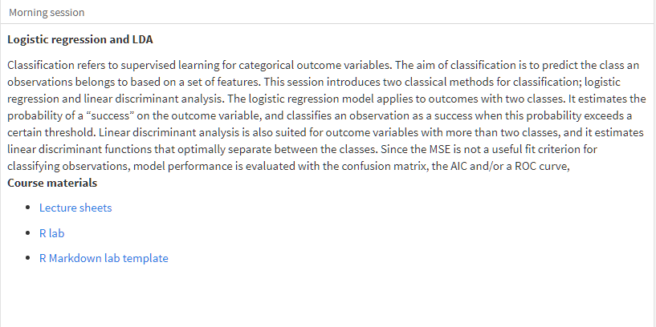
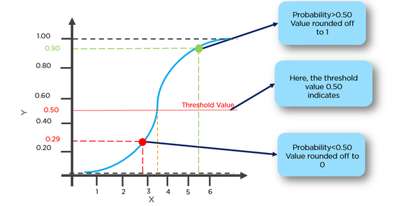
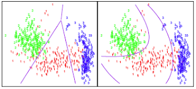
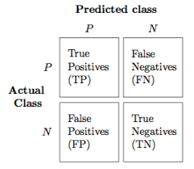
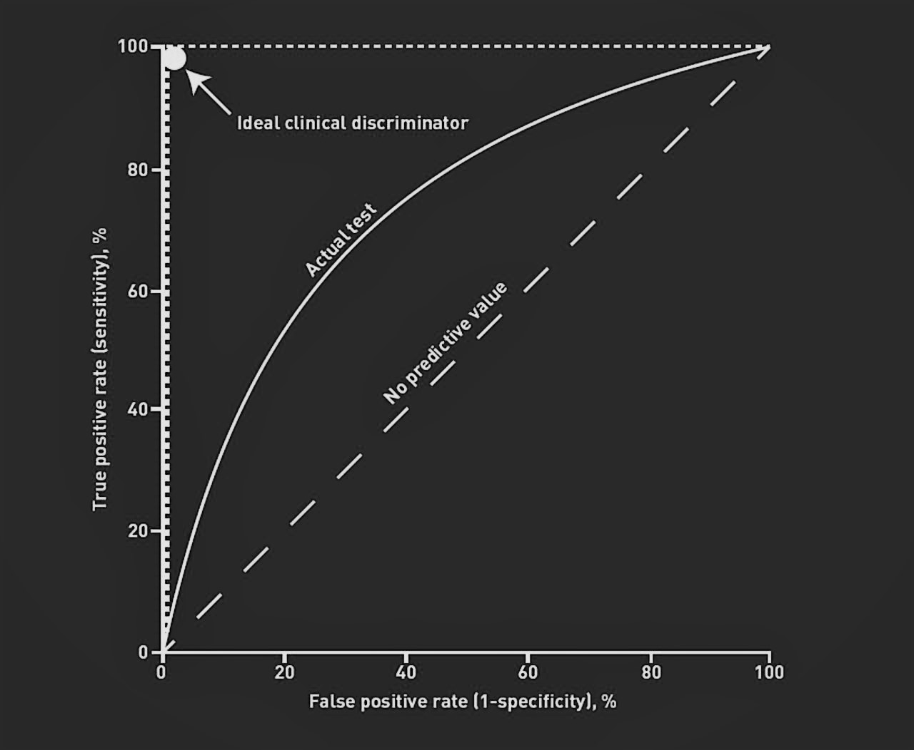

```{r setup, include=FALSE, message=F}
knitr::opts_chunk$set(echo = FALSE, comment="", message=F)
require(ISLR)
require(pROC)
require(MASS)
library(caret)
library(dplyr)
```

## Program




## Categorical outcomes

How to make the following predictions:

- What will be a person's voting behavior given a set of background variables? 

- How to diagnose a patient given a set of symptoms?

- What are the predictors for successfully stopping with smoking?


$~$


These questions involve the prediction of a class and not of a score.

The linear model is unsuited for this purpose, but what is? 

## Content

1. Logistic regression

2. Discriminant analysis

3. Classification criteria


## What's classification?

Outcome variable is categorical

- Predict **class membership** from feature set

$~$

Estimation 

1. Estimate $P(class = j\mid  features)$

2. Assign observation to class with largest probability 


$~$

Models (in order of interpretability)

- Logistic regression, Discriminant analysis, Trees, Random Forests, Bagging, Boosting, SVM, etc.

# Logistic Regression 


## Binary logistic regression (BLR)

Model to predict probability that $Y$ is a "success" 

$$\mbox{logit}(success)=\beta_0+\beta_1x_1+\dots$$

$~$

$$odds(success)=e^{\beta_0+\beta_1x_1+\dots}$$

$~$

$$P(success)=\frac{e^{\beta_0+\beta_1x_1+\dots}}{1+e^{\beta_0+\beta_1x_1+\dots}}=\frac{1}{1+e^{-(\beta_0+\beta_1x_1+\dots)}}$$


## Logistic vs linear regression

- estimates of logistic model in interval (0, 1) 

- estimates of linear model are not probabilities

```{r echo=F, out.width="100%", fig.align='center'}
knitr::include_graphics("pics/Lin_vs_LogReg.png")
```

## Link function 

Logistic model is a _generalized linear model_ with the logit link function


$$\text{logit}(success)=\beta_0+\beta_1x_1+\dots+\beta_kx_k$$
$~$

The "logit" is the log of the odds, so that after exponentiation

$$odds(success)=e^{\beta_0+\beta_1x_1+\dots+\beta_kx_k}$$
$~$

and the relationship between odds and probabilities is

$$P(success)=\frac{odds(success)}{1+odds(success)}$$

## Classification procedure in R

Conversion of estimated probabilities into classifications

\footnotesize
```{r echo=T, eval=F}
fit_glm  <- glm(y ~ x1 + x2 . . .,       
                family = "binomial",  
                link = "logit",       # default for "binomial"
                data   = <data>)      

pred_glm  <- predict(fit_glm,            
                     data = <data>,       
                     type = "response")  # alternative is "link"

class_glm <- factor(pred_glm > 0.5,      
                    labels = c("success", "failure")) 
```

## Schematically


```{r echo=F, out.width="100%", fig.align='center'}

```

## Example

Logit of diabetes by females of Pima tribe.

$$\mbox{logit}(diabetes) = -9.514+0.141\cdot{npreg} + 0.037\cdot{glu}~+~...$$
$~$

\footnotesize
```{r echo=T}
pima_glm <- glm(type ~ ., binomial, Pima.te)
coef(summary(pima_glm)) %>% round(3)
```

## Classification


Probability estimates and classifications of first 10 cases:

\footnotesize
```{r echo=T}
p <- predict(pima_glm, Pima.te, type = "response")
data.frame(
  probability    = round(p[1:10], 3),
  classification = factor(p[1:10] > .5, labels = c("no diabetes", "diabetes"))) 
```

## Pros and cons

Pros

- straightforward interpretation of effects of predictors 

- weak assumptions w.r.t. distribution of features

$~$

Cons

- unreliable parameter estimates when

    - large number of predictors
    
    - predictors with rare categories 
    

# Discriminant Analysis 


## What's discriminant analysis

Separates classes based on $k$ discriminant functions

- $k$ directions in feature space that best separate between classes

- $k = \mbox{min}(\# classes-1, \# features-1)$

$~$

```{r echo=F, out.width="50%", fig.align='center'}
knitr::include_graphics("pics/discriminant.png")
```


## Linear Discriminant Analysis (LDA)


Estimate _posterior_ probability $P(X=x|Y=j)$ of class $j=1,\dots,J$ 
  
$$P(Y=j|X=x)=\frac{\pi_jP(X=x|Y=j)}{\sum_{k=1}^J\pi_kP(X=x|Y=k)}$$  


$~$

- $\pi_j$ is _prior probability_ of class $j$ (sample proportion) 

$~$

- $P(X=x|Y=j)$ are sample means of $X$ within classes of $Y$

## Linear discriminant functions

Linear discriminant functions 


$$LD_j=c_{1j}X_1+\dots+c_{pj}X_p$$
$~$

- $LD_1$  separates the classes best, $LD_2$ second best, and so on

- $LD$'s are orthogonal


$~$

Assumption $X|Y\sim{N(\boldsymbol\mu}, \boldsymbol\Sigma)$ 

- $X$ is multivariate normal within each class

- $X$ has covariance matrix $\boldsymbol\Sigma$  within each class

## Quadratic Discriminant Analysis (QDA)

Estimates covariance matrix $\boldsymbol\Sigma_j$ for each class, with

- quadratic discriminant functions

- more parameters, so less bias but higher variance

$~$

```{r echo=F, fig.cap="Linear vs quadratic discriminant functions", out.width="80%", fig.align='center'}

```

## DA in R


Functions `lda()` and `qda()` of base R package `MASS`

- for LDA (for QDA it works the same):

$~$

\footnotesize
```{r echo=T, eval=F}
fit_lda   <- lda(formula, data = <data>)

pred_lda  <- predict(fit_lda, newdata = <data>)

prob_lda  <- pred_lda$posterior

class_lda  <- pred_lda$class
```


## Example

\footnotesize
```{r echo=T}
pima_lda <- lda(type ~ ., Pima.te)
```

- prior probabilities  $\pi$

```{r echo=T}
pima_lda$prior %>% round(3)
```


- conditional means $P(X=x|Y=j)$

```{r echo=T}
pima_lda$means %>% round(1)
```


## Linear discriminant function and projections

\footnotesize
```{r}
pima_lda$scaling %>% round(4) %>% t()
plot(pima_lda)
```


## Predictions

\footnotesize
```{r echo=T}
pima_pred <- predict(pima_lda, Pima.te)
```

- first 10 predictions

```{r echo=T}
data.frame(
  posterior = round(pima_pred$posterior, 3),
  class     = pima_pred$class
)[1:10, ]
```

## Pros and cons

Pros

- performs better in conditions where logistic regression is unstable

$~$

Cons

- LDA depends on normality assumptions and equality of covariance matrices

- QDA relaxed equality assumption but is more complex (high variance)


# Classification criteria 

## Goodness-of-fit criteria 


a. Deviance statistic (the closer, to 0 the better the fit)

$$D=2\sum_i{y}_i\log\frac{y_i}{\hat{\pi_i}}+(1-y_i)\log\frac{1-y_i}{1-\hat{\pi_i}}$$


$~$

b. AIC (the smaller the value, the better the fit)

    - deviance plus penalty for model complexity (2 times \# parameters)

$~$

c. Confusion matrix (accuracy of classifications)

    + proportions correctly/incorrectly classified


$~$

d. ROC curve 

    + sensitivity and specificity for sequence of cut-off values

    + Area Under Curve (AUC) (50% is guessing, 100% is perfect)


## Deviance and AIC

\footnotesize

- Model with 1 predictor

```{r}
glm(type ~ glu, binomial, Pima.te)
```

- Model with all predictors
```{r}
data.frame(
value = c(summary(pima_glm)$deviance, summary(pima_glm)$aic), row.names = c("Residual Deviance", "AIC"))
```


## Confusion matrix

\footnotesize

- Accuracy: $(TP+TN)/(TP+TN+FP+FN)$ 

- Misclassification error rate = 1 - accuracy

- Sensitivity: $TP/(TP+FN)$

- Specificity: $TN/(TN+FP)$

```{r echo=F, out.width="40%", fig.align='center'}

```


Different cutoff values result in different matrices 

## ROC and AUC

\footnotesize

- the larger the area under the curve, the better the model performance

```{r echo=F, out.width="70%", fig.align='center'}

```

# Model comparisons


## Cross-validate accuracy


\footnotesize
```{r echo=T, eval = FALSE}
fit_cv <- train(type ~ ., 
                data      = Pima.te, 
                method    = "glm", 
                metric    = "Accuracy",
                trControl = trainControl(method = "cv", 
                                         number = 5))
```
\normalsize

Compare `accuracy` of Pima.te for `glm`, `lda` and `qda`:

- with cross-validation:  `fit_cv$results$Accuracy`

- without cross-validation: `fit_cv$finalModel`


```{r}
BLR <- train(type ~ ., 
                 data   = Pima.te, 
                 method = "glm", 
                 metric = "Accuracy",
                 trControl = trainControl(method = "cv", 
                                          number = 5))

LDA <- train(type ~ ., 
              data   = Pima.te, 
              method = "lda", 
              metric = "Accuracy",
              trControl = trainControl(method = "cv", 
                                       number = 5))
QDA <- train(type ~ ., 
              data   = Pima.te, 
              method = "qda", 
              metric = "Accuracy",
              trControl = trainControl(method = "cv", 
                                       number = 5))
```


## Confusion matrices final models

\scriptsize
GLM
```{r}
pima_glm      <- glm(type ~ ., family = binomial, data=Pima.te)
pima_class    <- factor(pima_glm$fitted > 0.5, labels = c("No", "Yes"))
(blr_conf <- table(observed = Pima.te$type, estimated = pima_class))
```
LDA
```{r}
pima_lda      <- lda(type~., data=Pima.te)
pima_lda_pred <- predict(pima_lda, Pima.te)
pima_class    <- pima_lda_pred$class
(lda_conf <- table(observed = Pima.te$type, estimated = pima_class))
```
QDA
```{r}
pima_qda      <- qda(type~., data=Pima.te)
pima_qda_pred <- predict(pima_qda, Pima.te)
pima_class    <- pima_qda_pred$class
(qda_conf <- table(observed = Pima.te$type, estimated = pima_class))
```

## Accuracy


Accuracy with and without cross-validation:

- GLM performs best with cross-validation 

- QDA performs best without cross-validation 

```{r}
matrix(round(
  c(BLR$results$Accuracy, 
    LDA$results$Accuracy,
    QDA$results$Accuracy,
    sum(diag(blr_conf))/332,
    sum(diag(lda_conf))/332,
    sum(diag(qda_conf))/332), 3), 3, 2,
  dimnames=list(c("BLR", "LDA", "QDA"), 
                c("Cross-validated", "Final model"))
)
```


## ROC's and AUC's

```{r fig.asp=.7}
roc_glm <- roc(Pima.te$type, pima_glm$fitted)
roc_lda <- roc(Pima.te$type, pima_lda_pred$posterior[, "Yes"])
roc_qda <- roc(Pima.te$type, pima_qda_pred$posterior[, "Yes"])

par(mar=c(3, 4, 1, 2))
plot(roc_glm, col=2, lwd=1)
plot(roc_lda, add=TRUE, col=3, lwd=1)
plot(roc_qda, add=TRUE, col=4, lwd=1)
legend("bottomright", legend=c("GLM: auc = 0.869", "LDA: auc = 0.867","QDA: auc = 0.876"), lty=c(1,1,1), col=2:4)

```


