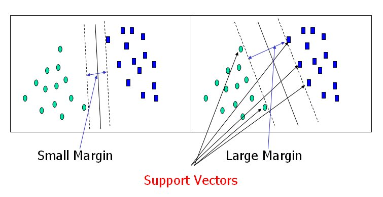
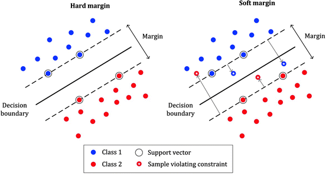

```{r setup, include=FALSE, message=F}
knitr::opts_chunk$set(echo = FALSE, comment="", cache=T, size="footnotesize")
library(MASS)
library(ISLR)
library(tree)
library(randomForest)
library(fastAdaboost)
library(caret)
library(e1071)
```


##  Program


## Classification trees


##  Content

1. Classification trees

2. Pruning

3. Bagging, random forests

5. Boosting

6. Support Vector Machines

##  Classification trees

1. Recursive binary splitting algorithm

2. Splits features on basis of node _purity_ 

- Gini index 
   
- deviance


```{r fig.height=4, fig.cap = "Sale of car seats (Yes/No)"}
tree.carseats  <- tree(factor(Sales < 7, labels = c("Yes", "No")) ~ CompPrice + Income + Advertising, Carseats)
plot(tree.carseats)
text(tree.carseats)
```


## Recusrsive binary splitting

Algorithm

1. Divide feature space in non-overlapping, rectangular regions

2. Choose splits that minimize _node impurity_ (homogeneity of nodes)
    
3. Assign region to class with highest mode

4. Stop when node purity no longer increases 


$~$ 

Algorithm is top-down and greedy, so

- high variance


## Classification with trees or regression?

Depends on nature of relationship between classes and features 


{width=250px}


## Package `tree`

Growing and plotting trees with function `tree()`

\footnotesize
```{r echo=T, eval=F}
fit_tree <- tree(formula, data, split = c("deviance", "gini"))
                 
plot(fit_tree)
text(fit_tree)
```
\normalsize

- minimization of `deviance` or `gini impurity` 

- `text()` for adding labels to nodes

## Methods to reduce variance:


1. Pruning 

    - cut branches with cross-validation and regularization

$~$

2. Bagging 

    - average predictions of bootstrapped trees

$~$

3. Random forests 

    - average predictions of decorrelated bootstrapped trees

$~$

4. Boosting 

    - weighted combination of weak classifiers (small trees)


# Pruning


## Cost-complexity pruning (package `tree`)


1. Cross-validate tree to find optimal number of nodes

    - based on either deviance or misclassification error rate

$~$

2. Prune the tree with optimal number of nodes 

    - number of nodes with smallest deviance/misclassification error rate

$~$

3. Get predictions of pruned tree on test set

    - `predict.tree` returns either probabilities or classifications

$~$
\footnotesize 

```{r echo=T, eval=F}
cv.tree(fit_tree, method = c("deviance", "misclass"))

pruned_tree <- prune.tree(fit_tree, best = <number>)

predict(pruned_tree, newdata, type = "class")
```


## Pruning example


```{r echo=F,  out.width="80%"}
knitr::include_graphics("pics/pruning.png")
```


```{r include=F}
set.seed(1)
train <- sample(nrow(Pima.te), nrow(Pima.te)/2, 
                replace=FALSE)

pima.train <- tree(type ~ . , data=Pima.te, subset=train)
plot(pima.train); text(pima.train)
pima.cv <- cv.tree(pima.train)
pruned_tree <- prune.tree(pima.train, best=2)
plot(pruned_tree); text(pruned_tree)
```


# Bagging, random forests

## Algorithm

1. Fit classification trees to $B$ bootstrap samples

2. Average the predictions 

3. Out-Of-Bag (OOB) as estimate validation error

```{r echo=F,  out.width="80%", fig.align="center"}

```

 


## Bagging vs random forests


Bagging 

- considers all predictors at each split

- best predictors turn up in each tree

- highly correlated trees

- high variance

$~$

Random forests

- considers random sample of predictors at each step

- all predictors get a fair chance

- decorrelated trees 

- lower variance

## Out-of-bag error rate

On average 1/3 of observations not in bootstrap (Out-Of-Bag)

- OOB cases used to compute validation error 

- no need for cross validation

- computationally very efficient


## Variable importance

When averaging trees the tree structure is lost

- how to interpret solution then?

- effect predictors averaged over trees

- visualize with *variable importance* plots


```{r fig.height = 5}
set.seed(1)
pima.bag <- randomForest(type ~ ., 
                         Pima.te[train, ], 
                         ntree = 500, 
                        # mtry = 7, 
                         importance = TRUE)

varImpPlot(pima.bag, main="")
```


## Package `randomForest`


Functions for bagging/random forest

\footnotesize

```{r eval = F, echo=T}
fit <- randomForest(formula, data, 
                    ntree   = 500, 
                    mtry    = <number predictors at each split>,
                    importance = TRUE)

varImpPlot(fit)

predict(fit, newdata, type = "prob")

```

\normalsize

- `mtry`: default random forest (bagging total number predictors)

- `ntree` is tuning parameter (overfitting when too large)

- `importance = TRUE`  for `varImpPlot()`

- default `type` yields predicted class

# Boosting

## Algorithm

1. Apply a weak classifier (e.g. stump) to training data

2. Increase weights for incorrect classifications, and repeat

3. Classifier is linear combination of weak classifiers

```{r echo=F,  out.width="100%", fig.align="center"}
knitr::include_graphics("pics/boosting.png")
```


## Boosting vs bagging/random forest

```{r echo=F,  out.width="100%", fig.align="center"}

```

## Boosting with package `fastAdaboost` 

Boosting a single model

- `nIter` is number of weak classifiers

```{r echo=T, eval=F}
ada <- adaboost(formula, data, nIter)

predict(ada, newdata)
```

- `nIter` is number of weak classifiers (overfitting when too large)

- predictions include classes, probabilities and misclassification error

## Boosting with package `caret` 

Determine `nIter` with cross validation 

- use the method `adaboost` in the function `train()` 

- specify a sequence of values for `nIter`


\footnotesize

```{r echo=T, eval = F}
ada <- train(formula, 
             data, 
             method    = "adaboost", 
             trControl = trainControl(method = "cv", number = 5),
             tuneGrid  = expand.grid(method = "Adaboost.M1",
                                     nIter  = <test sequence>))

predict(ada, newdata, type = "prob")
```

\normalsize

- "Adaboost.M1" restricts search to one of two methods

- default `type` yields predicted class

# Support Vector Machines (SVM)

## SVM for binary classification


Classifiers using support vectors

1. *maximal margin classifier*

    - classes perfectly separable by hyperplane

$~$

2. *support vector classifier*

    - allows for non-separable cases

$~$

3. *support vector machine*

    - allows for non-linear boundaries
    
    
## Hyperplane

Divides the feature space in two


- in two dimensions hyperplane is simply a line

```{r echo=F,  out.width="70%", fig.align="center"}

```

## Separating hyperplane

Perfectly separates the two classes of the outcome variable

- hyperplane not uniquely identified

- high variance

```{r echo=F,  out.width="90%", fig.align = "center"}

```


## Maximal Margin Classifier 

Identifies hyperplane by specification of a maximal marging

- points on margin are support vectors

- only works if cases are  *separable* 

```{r echo=F,  out.width="90%", fig.align = "center"}

```


## Support Vector Classifier (SVC)

Allows for violations of the margin (soft margin)

- budget for violations is called *cost* $(C)$

- cases the wrong side of hyperplane contribute to the cost

```{r echo=F,  out.width="90%", fig.align = "center"}

```


## Support Vector Machines (SVM)

Kernels allow for nonlinear hyperplanes, e.g.

- polynomial kernel (left)

- radial kernel (right)


```{r echo=F,  out.width="90%", fig.align = "center"}
knitr::include_graphics("pics/kernel.png")
```

##  SVM with pacakge `e1071`


\footnotesize

```{r echo=T, eval=F}
svm_train <- tune(svm, formula, data, 
                  degree = 3, #default
                  coef0  = 0, #default
                  cost   = 1, #default
                  kernel = c("linear", "polynomial", "radial"),
                  ranges = list(cost = <sequence>), etc.)

svm_train$best.model # performance summary

svm_class <- predict(svm_train, newdata, probability = TRUE)
svm_prob  <- attr(svm_class, "probabilities")
```

\normalsize

- `cost`, `degree` and `coef0` are tuning parameters 

- `ranges` works similar as `tuneGrid()` 


## SVM classification plot

Compression hyperplane two dimensions


\footnotesize
```{r eval=F, echo=T}
plot(svm_train$best.model, data, x1 ~ x2)
```


```{r echo=F,  out.width="70%", fig.align = "center"}

```


## Pro's and con's classifiers

\footnotesize 

BLR

- robust against outliers but potentially unstable 

$~$

LDA

- better stability but sensitive to normality violations


$~$

Tree-based methods

- top-down and greedy, so bias-variance control needed

- boosting considered as one of the best methods


$~$

SVM

- similar to BLR (same loss function), but allow for non-linearity 


 