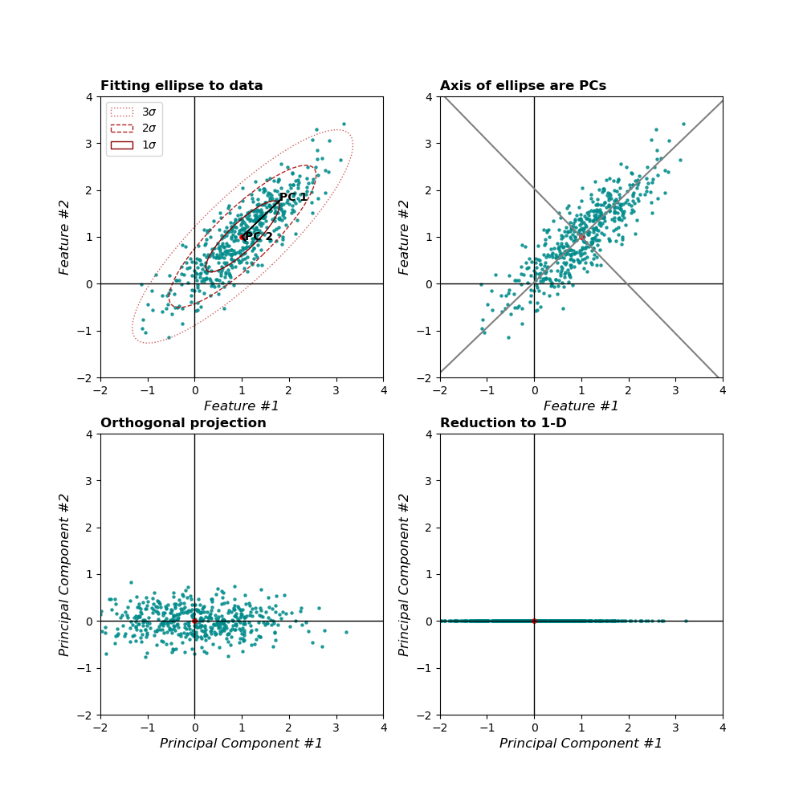

```{r setup, include=FALSE, message=F}
knitr::opts_chunk$set(echo = FALSE, comment="", message=F)
library(MASS)
library(psych)
library(ggplot2)
library(dplyr)
library(gridExtra)
```

##   Program


##  Content

1. Unsupervised learning

2. Principal components analysis

3. Iris data
    


##  Supervised vs unsupervised

\ \ Known outcome \ \ \ \ \ \ \ \ \ \ \ \ \ \ \ \ \ \ \ \ \ \ \ \ \ \ \ Unknown outcome


## Unsupervised learning


# Principal Components Analysis


## How to make customer profiles?

Profiles of bought products 

- many products but only a few profiles

```{r out.width="70%", fig.align = "center"}

```

## What is Principal Components Analysis

Data of high dimension

- many features containing different information 

- high correlations within groups of features 

- low correlations between groups of features


$~$

Dimension reduction

- groups of correlated features form a single principal component

- different groups form different principal components 


## 


## Principal components

The $p$ principal component $Z_j$ are computed as:

$$Z_j=\phi_{1j}X_1 + \dots{} + \phi_{pj}X_p, \ \ \ \ j=1,\dots, p$$


- $Z_j$ is weighted sum of the features

- $\phi_{1j}$ is loading of $X_1$ on $Z_J$ (like a correlation)

$~$

The  $Z_1,\dots{},Z_p$ are ordered in terms of explained variance


## PCA in two-dimensional space




## PCA in high-dimensional space

Properties of principal components (PCs)

- explained variance is expressed in _eigenvalues_

- sum of eigenvalues is $p$ (number of features)

- PCs with eigenvalues > 1 are considered informative 

- PCs with eigenvalues < 1 are considered noise

$~$

Dimension reduction criteria, retain PC's  

- with eigenvalues > 1

- above the elbow in scree plot

## PCA vs LDA


- PCA maximizes variance between data points

- LDA maximizes variance between groups 

```{r echo=F,  out.width="70%", fig.align="center"}

```


## Rotation

Facilitates interpretation of PC's

- maximizes loading on one PC 

- minimizes loadings on others


```{r echo=F,  out.width="90%", fig.align = 'center'}

```

# Iris data

## Example iris data

4-dimensional data:

- 150 Iris flowers (3 species)

- 4 features 

    - petal length 
    
    - petal width
    
    - sepal length
    
    - sepal width 


```{r echo=F,  out.width="70%", fig.align =  "center" }

```


## Feature structure in 4 dimensions

```{r fig.asp=.7}
plot(iris[, 1:4], cex=.5, col=iris$Species)
```

## PCA solution with 4 components

\footnotesize
```{r echo=T}
pc4 <- principal(iris[, 1:4], nfactors = 4, rotate = "none")

print(loadings(pc4), cutoff = .1)
```


## Elbow criterion

```{r}
VSS.scree(iris[, -5])
```

**Conclusion**: Extract one or two PCs (elbow is unclear)

## Unrotated loadings

\footnotesize

````{r echo=T}
pc2 <- principal(iris[, -5], nfactors = 2, rotate = "none")
round(loadings(pc2)[1:4, 1:2], 2)
```
```{r fig.align='center', fig.asp = .4}
biplot(pc2, choose = 1:2, main = "")
```


## Rotated loadings


\footnotesize

````{r echo=T}
pc2rot <- principal(iris[, -5], nfactors = 2, rotate = "varimax")
round(loadings(pc2rot)[1:4, 1:2], 2)
```


```{r fig.align='center', fig.asp = .4}
biplot(pc2rot, main = "")
```


## PC scores with species in 1 and 2 dimensions

```{r}
grid.arrange(
    as.data.frame(pc2$scores) %>% 
    ggplot(aes(PC1, PC2, col = iris$Species)) +
    geom_point() +
    theme_minimal(),
    as.data.frame(pc2$scores) %>% 
    ggplot(aes(PC1, fill = iris$Species)) +
    geom_density(alpha=.2) +
    theme_minimal(),
    nrow = 2
)

    
```


## Large data sets


Function `prcomp()` handles data with $p>n$

\footnotesize
```{r echo = TRUE}
pc2 <- prcomp(x = iris[, -5]) 
```
\normalsize

$~$

We need this function in the lab for some exercises.


 

