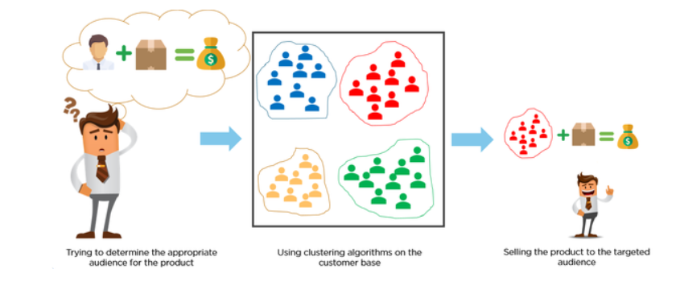
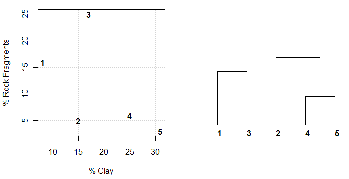

```{r setup, include=FALSE, message=F}
knitr::opts_chunk$set(echo = FALSE, comment="")

library(dplyr)
library(ggplot2)
```

##    Program


##    Content


1. K-means clustering

2. Hierarchical clustering


## Customer segregation with k-means


   

## Taxonomis with hierarchical clustering


# K-means clustering

##  K-means algorithm

1. Specify the total number of clusters $K$

2. Randomly assign each observation to a cluster

3. Compute cluster centroids 
     
4. Reassign observations to cluster with closest centroid 

5. Repeat 3 and 4 until convergence 

$~$

```{r echo=F,  out.width="60%", fig.align="center"}

```


## Issues

**Determination optimal number of clusters**

- elbow criterion for within-cluster SS

$~$

**Solution is local minimum of within-cluster SS**

- try out multiple starting values, e.g.

$~$

**Data**

- standardization of features (as in PCA)

- clustering on principal components often works better


## Optimal number of clusters

Would a solution with 3 clusters been better?

```{r echo=F,  out.width="100%", fig.align="center"}

```

## Elbow criterion

```{r echo=F,  out.width="100%", fig.align="center"}

```


## Local minimum

```{r echo=F,  out.width="100%", fig.align="center"}

```

## Scaling

```{r echo=F,  out.height="80%", fig.align="center"}

```


## K-means on iris data


Scree plot original iris data (scaled)

- 6 clusters 

- 10 random starts

```{r scree, fig.height =  6}
k_1 <- kmeans(scale(iris[, 1:4]), centers = 1, nstart = 10)
k_2 <- kmeans(scale(iris[, 1:4]), centers = 2, nstart = 10)
k_3 <- kmeans(scale(iris[, 1:4]), centers = 3, nstart = 10)
k_4 <- kmeans(scale(iris[, 1:4]), centers = 4, nstart = 10)
k_5 <- kmeans(scale(iris[, 1:4]), centers = 5, nstart = 10)
k_6 <- kmeans(scale(iris[, 1:4]), centers = 6, nstart = 10)

plot(1:6,  
       c(k_1$tot.withinss,
         k_2$tot.withinss, 
         k_3$tot.withinss, 
         k_4$tot.withinss, 
         k_5$tot.withinss, 
         k_6$tot.withinss),
     type="b", ylab = "within clusters ss", xlab="k")
```

##

\scriptsize

```{r}
print(k_3)
```

## Original data vs PC's 

Sometimes clustering on less dimensions work best


```{r iris, fig.asp = .5}
iris.pca <- princomp(iris[, 1:4], cor = TRUE)
set.seed(2)
cl3_pca <- kmeans(iris.pca$scores[, 1], centers = 3, nstart=1)
par(mfrow=c(1,2))
plot(iris.pca$scores[, 1], iris.pca$scores[, 2], col = iris$Species, pch = k_3$cluster,
     xlab = "principal component 1", ylab = "principal component 2", main= "K-means on original data")
legend("bottomright", legend=c("cluster 1","cluster 2","cluster 3"), pch = 1:3)

plot(iris.pca$scores[, 1], iris.pca$scores[, 2], col = iris$Species, pch = cl3_pca$cluster,
     xlab = "principal component 1", ylab = "principal component 2", main = "K-means on 1st component PCA")
legend("bottomright", legend=c("cluster 1","cluster 2","cluster 3"), pch = 1:3)
```

## Confusion matrices


- K-means on scaled `iris` data

```{r}
table(iris$Species, k_3$cluster)
```


- K-means on 1st principal component


```{r}
table(iris$Species, cl3_pca$cluster)[, c(3,1,2)]
```

## K-means in R

\footnotesize

```{r eval=F, echo=T}
k_fit <- kmeans(x, centers, nstart = 1)  # scale(x) for standardization

print(k_fit)   # print a summary

fitted(k_fit)  # centroids for each case

k_fit$withinsss # total within-cluster sum of squares
```


# Hierarchical clustering

## Algorithm (bottom-up and greedy)

0. Standardize all features

1. Treat each observation as a cluster 

2. Compute *distances* between all $n\choose{2}$ cluster pairs 

3. Link pair with smallest *distance* in new cluster

4. Repeat 2-3 until 2 clusters left

6. Plot dendogram (and optionally the clusters)

$~$

```{r echo=F,  out.height="40%", fig.align="center"}

```


## Compute distances


## Function `dist()`

\scriptsize

```{r echo=T}
dist(scale(iris[1:3, -(5)]), "euclidean")

dist(scale(iris[1:3, -(5)]), "manhattan")

dist(scale(iris[1:3, -(5)]), "maximum")
```

## Linkage methods


```{r echo=F,  out.height="70%", fig.align="center"}

```

## Effect linkage

```{r echo=F,  out.height="90%", fig.align="center"}

```


## Beer example 

\footnotesize

Cluster 10 beers types on calories and alcohol

- 3 types (ale, lager and wheatbeer)

$~$


```{r echo=F, fig.asp = .4}
beer     <- data.frame(type     =  c(rep("lager", 5), rep("wheatbeer", 3), rep("ale", 2)), 
                       calories = c(39.3, 39.3, 40, 40.7, 41.5, 44.5, 44.9, 49.3, 53.5, 53.4), 
                       alcohol  = c(5.2, 5, 5, 5.1, 5, 4.9, 5.2, 5.7, 7.5, 7.5))
ggplot(beer, aes(calories, alcohol, col = type)) +
   geom_point() +
   theme_minimal()
```


## Function `hclust()`


\footnotesize

- compute clusters

```{r eval=FALSE, echo=TRUE}
hc <- hclust(x = dist(scale(<data>), 
                      method = "euclidean"), 
             method = c("complete", 
                        "ward.D2", 
                        "single", 
                        "average",
                        "centroid")
```


- plot clusters

```{r eval=FALSE, echo=TRUE}
plot(hc, labels = <names observations>) # default is row names
             
rect.hclust(hc, k)                      # plot rectangles
```


## Comparisons

```{r fig.height=9}
par(mfrow=c(2,3))
plot(hclust(dist(scale(beer[, -1]))), 
     labels=beer[, 1], xlab="", sub="", main="complete")
plot(hclust(dist(scale(beer[, -1])), "ward.D2"), 
     labels=beer[, 1], xlab="", sub="", main="ward.D2")
plot(hclust(dist(scale(beer[, -1])), "single"), 
     labels=beer[, 1], xlab="", sub="", main="single")
plot(hclust(dist(scale(beer[, -1])), "average"), 
     labels=beer[, 1], xlab="", sub="", main="average")
plot(hclust(dist(scale(beer[, -1])), "centroid"), 
     labels=beer[, 1], xlab="", sub="", main="centroid")
```


## Number of clusters?


```{r}
hw <- hclust(dist(scale(beer[, -1])), method = "ward.D2")

par(mfrow=c(1,2))
plot(hw, labels = beer[, 1], xlab="", sub="", main="ward.D2, k = 3")
rect.hclust(hw, 3)
plot(hw, labels = beer[, 1], xlab="", sub="", main="ward.D2, k = 4")
rect.hclust(hw, 4)

```


